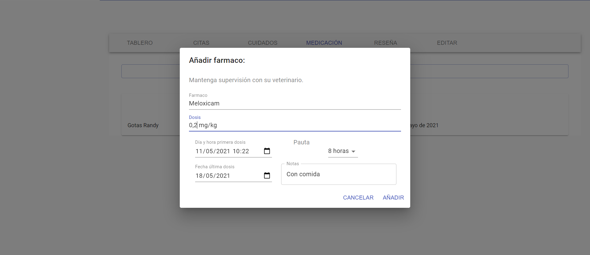
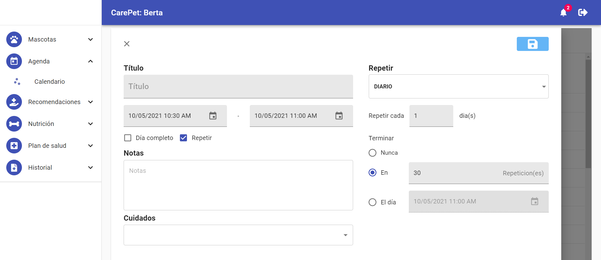
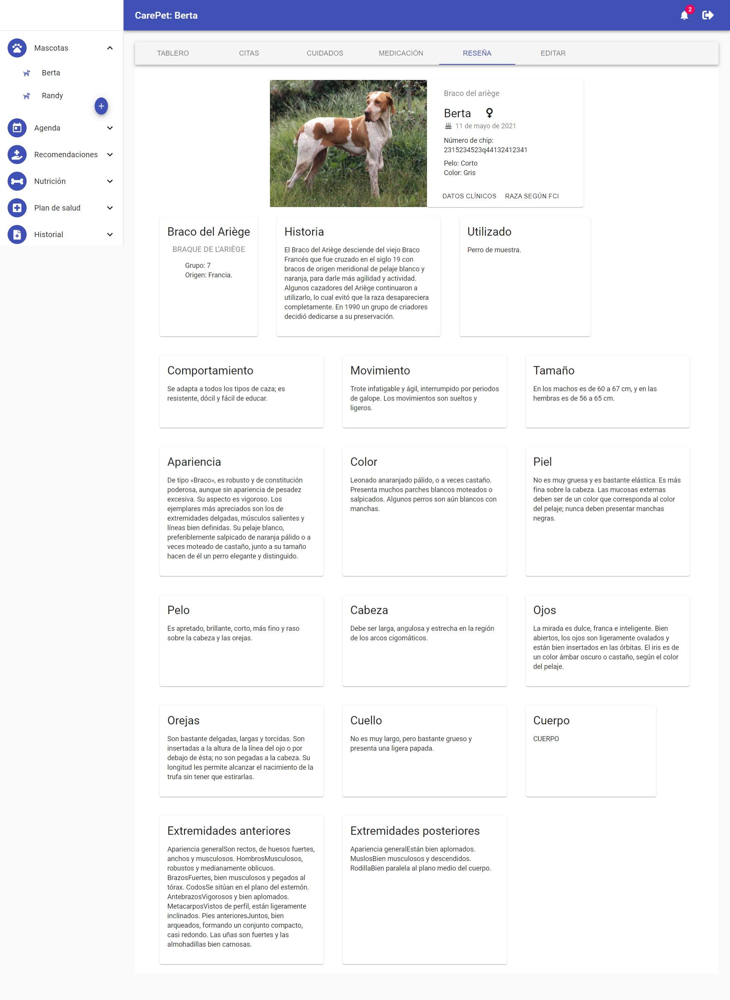

# CarePet - Web

<!-- PROJECT LOGO -->

<!-- <p align="center">
  <a href="https://infectme.herokuapp.com"> 
    
  </a>
  <br /> -->

  <!-- <h3 align="center">Infect Me</h3> -->

  <p align="center">
    A website to control daily care and centralize your pet's appointments.
    <br />
    <a href="https://github.com/joselrdg/CarePet-web"><strong>Explore the docs »</strong></a>
    <br />
    <br />
    <a href="https://petvet-web.herokuapp.com/">View Demo</a>
    ·
    <a href="https://github.com/joselrdg/CarePet-web/issues">Report Bug</a>
    ·
    <a href="https://github.com/joselrdg/CarePet-web/issues">Request Feature</a>
  </p>
</p>


<!-- TABLE OF CONTENTS -->
<details open="open">
  <summary><h2 style="display: inline-block">Table of Contents 🚀</h2></summary>
  <ol>
    <li>
      <a href="#about-the-project">About The Project</a>
      <ul>
        <li><a href="#built-with">Built With</a></li>
      </ul>
    </li>
    <li>
      <a href="#getting-started">Getting Started</a>
      <ul>
        <li><a href="#prerequisites">Prerequisites</a></li>
        <li><a href="#installation">Installation</a></li>
      </ul>
    </li>
    <li><a href="#usage">Usage</a></li>
    <li><a href="#roadmap">Roadmap</a></li>
    <li><a href="#contributing">Contributing</a></li>
    <li><a href="#license">License</a></li>
    <li><a href="#contact">Contact</a></li>
    <!-- <li><a href="#acknowledgements">Acknowledgements</a></li> -->
  </ol>
    
</details>


<!-- ABOUT THE PROJECT -->
## About The Project
### Dashboard:

### Simple graphics to see appointments quickly:

### Appointments:

### You can program your pet's drug guidelines:

### Calendar:




### Review and breeds of dogs:
Its own api provides you with a wealth of information on the 332 dog breeds approved by the Federation Cynologique Internationale.

### Recommendations:


<!-- Here's a blank template to get started:
**To avoid retyping too much info. Do a search and replace with your text editor for the following:**
`github_username`, `repo_name`, `twitter_handle`, `email`, `project_title`, `project_description` -->


### Built With 🛠️

* [NPM](https://www.npmjs.com/)
* [Axios](https://github.com/axios/axios)
* [React](https://es.reactjs.org/)
* [SASS](https://sass-lang.com/)
* [Material UI](https://material-ui.com/)
* [DevExpress](https://www.devexpress.com/)
* [Recharts](https://recharts.org/)


<!-- GETTING STARTED -->
## Getting Started

To get a local copy up and running follow these simple steps.

### Prerequisites

This is an example of how to list things you need to use the software and how to install them.
* npm
  ```sh
  npm install npm@latest -g
  ```

### Installation

1. Clone the repo
   ```sh
   git clone https://github.com/joselrdg/CarePet-web
   ```
2. Install NPM packages
   ```sh
   npm install
   ```
3. Create .ENV file with the following variables:
   ```sh
   REACT_APP_API_HOST=http://localhost:3001
   ```
4. Create .ENV.PRODUCTION file with the following variables:
   ```sh
   REACT_APP_API_HOST="Your api host"
   ```


<!-- ROADMAP -->
## Roadmap

See the [open issues](https://github.com/joselrdg/CarePet-web/issues) for a list of proposed features (and known issues).


<!-- CONTRIBUTING -->
## Contributing ✒️

Contributions are what make the open source community such an amazing place to be learn, inspire, and create. Any contributions you make are **greatly appreciated**.

1. Fork the Project
2. Create your Feature Branch (`git checkout -b feature/AmazingFeature`)
3. Commit your Changes (`git commit -m 'Add some AmazingFeature'`)
4. Push to the Branch (`git push origin feature/AmazingFeature`)
5. Open a Pull Request


<!-- LICENSE -->
<!-- ## License 

Distributed under the MIT License. See `LICENSE` for more information. -->


<!-- CONTACT -->
## Contact

José Luis Rodríguez , [josesietepicos@gmail.com](mailto:josesietepicos@gmail.com)

Project Link: [https://github.com/joselrdg/CarePet-web](https://github.com/joselrdg/Infect-me)

Demo Link: [https://petvet-web.herokuapp.com/](https://infectme.herokuapp.com/)

<!-- ## Acknowledgements -->